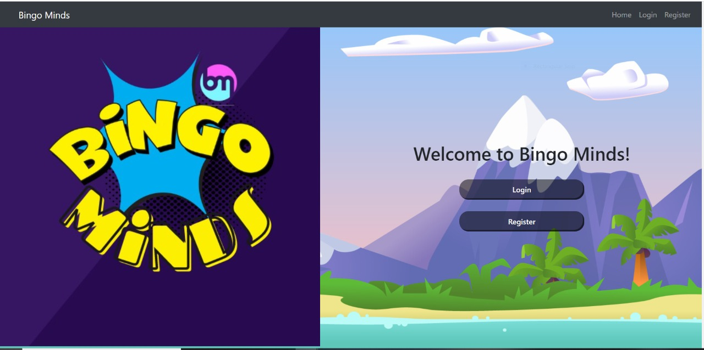
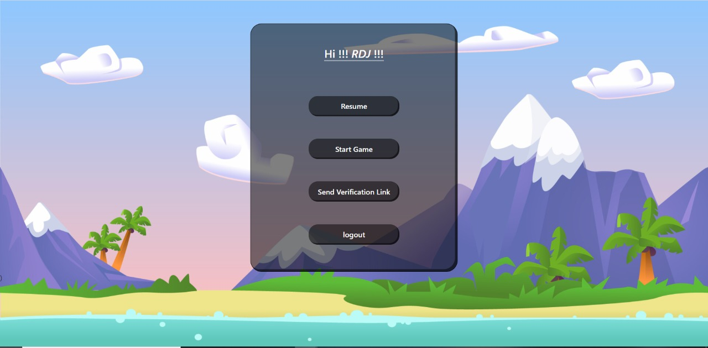
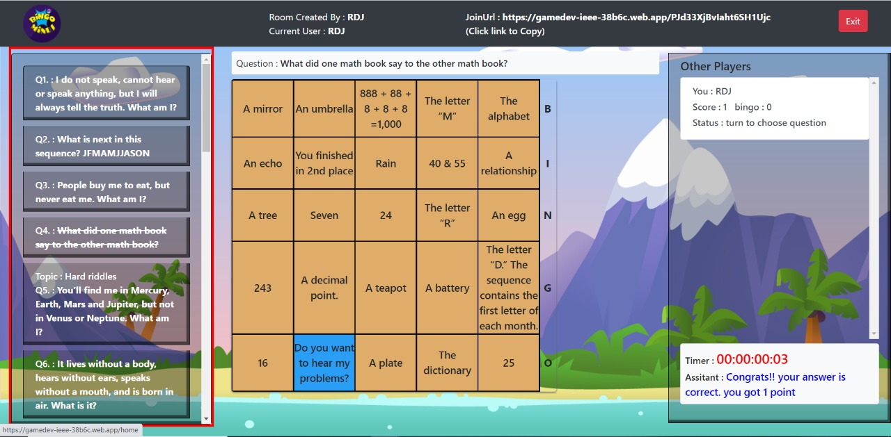
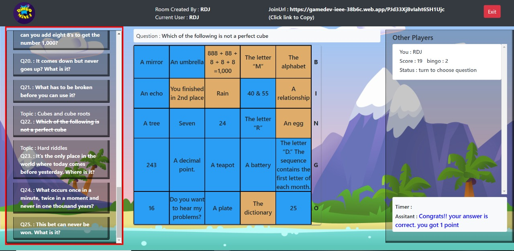
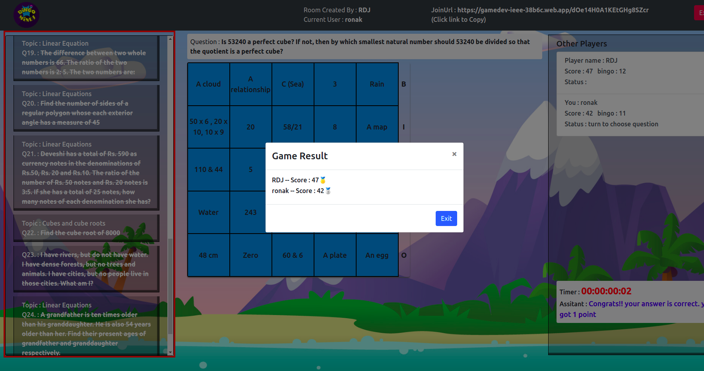

# Bingo Minds : An  Educational Game

Can you hear the BINGO MINDS? Get started for your Bingo adventure!

Play the CUTEST and MOST FUN FREE BINGO GAME ONLINE!
Become a bingo winner ,learn many things and enjoy the Fun  for free. We will make sure it will be your 2021 bingo Adventure!

Find your Lucky Bingo Card and the Game as like a Normal Bingo but instead of  Randomly crossing of numbers you have  to give the Right Answers of the Questions For crossing each Number Present in Your Cad.After Completing the any 5 rows,columns ,Diagonals Tiles presents in the Card ,You have to Click The Bingo button to win the Game.

BINGO MINDS is the free online Adventure and Educational Game that Helps to improve the skills Solving the questions as well as its Improves the knowledge also. This game allows You to Play the game with Your Friends anywhere at anytime. So gather up your Friends,roll up your Sleeves ,spin to win and have fun with ultimate Bingo Showdown.This is a bingo Journey you do not want to miss! Run,dash ,surf,spin or slither on over and let’s escape into some online absolute Bingo Magic! .May the best bingo Player and the best set of bingo cards wins_ _ _ _ _ _ BINGO!!!!!!!

## About Game :

This is a Bingo Based Game where the participants have to answer questions based on 8th Class CBSE Syllabus of Mathematics, General Knowledge and Riddles.


## Learning Objectives of Game :

- The Game will enhance the mathematical learning capabilities of students with added fun of competition as questions from other non conventional subjects

- It will develop user operational speed, strategy building and problem solving skills.

- It will help students to increase their knowledge and prepare for a competitive exam environment.

## Reward policy  :  

- Players will get the 1 points for correct answers.
- There will be no  negative marking for wrong answers.
- If a player skips the question there will be no negative marking.
- Bonus points will be given on the basis of Bingo if any particular row,column or diagonal is completed marked, then Bingo complete and player  will receive 2 points.
- Player will GET REWARDED with bingo bonuses at different stages for being a loyal bingo player.


## Please Note:

- This  game is intended for Students.
- The Game does not offer “Real Money Gambling” or an opportunity to win real money or prizes.
- The main objective of the Game is to develop the problems solving Skills as well and Improves the Knowledge of the Students.
- If any Bugs takes place,we are always there to remove the Bug as Improves the Quality of the Game

## System Requirments
- Apache Server
- MySQL
- PHP 5.3 and above
- Linux Shared Hosting

## Installation and Configuration

1. Clone the project
``` 
git clone https://github.com/unscrewedakshit/GameDev-IEEE.git
```
2. Create a project in the firebase account and then add the credential of firebase to the project in /src/firebase.json file.
 
 ```
var firebaseConfig = {
  apiKey: "",
  authDomain: "",
  projectId: "",
  storageBucket: "",
  messagingSenderId: "",
  appId: ""
};
```

3. For testing project on local server
```
npm install
npm start
```
- server will start in http://localhost:3000

4. For building the project
```
npm install 
npm build
```

## User Manual

- Name of Game : Bingo Minds
- Learning Objective : 
    -   This game will enhance the mathematical learning capability of players with added fun.
    -   Quiz Bingo is a fun way to learn & practice.
    -   It will encourage and engage users by providing winning opportunities through  Mathematical problem solving.
    -   It will develop user operational speed, strategy building and problem solving skills.
    -   It will increase the knowledge of students.
    -   It will help users to prepare for a competitive exam environment.

- Topic & Level :
    - Currently the test database has questions from
        -   Class 8 CBSE Mathematics
        -   Riddles
        -   General Knowledge
        -   Aptitude
    - Levels of question
        - Level Varies with Easy,Medium and Hard Questions
- Target Users
    - School Students of 8th Grade Onwards
- Prerequisites
    - Only Subject Knowledge Required, Playing and Getting Famailier with Game Interface is Easy.
- Steps to Use Game
    - Login:Players have to log in First with the Name and Some additional information.
    - Playing Room Creation: Player has to create the Room and Play with there friends. (Multiplayers)
    - Playing Theme: Players will randomly given 25 Question from the topics which can be related to Math, General Knowledge, Riddles questions etc.
    - Game Zone: Players will get the 5x5 bingo card having tiles with the answers of 25 Questions written on it. For each player tiles will be in     random order and not visible to each other.
    - Rule Book: There will be a set of questions; players will take chances to select any one question from it.
After selecting the question, that question will be visible to all the players and then they will solve the question and select the correct answer tile from the bingo card.
    - If selected correctly they will get points for it and that tile will be marked and if not there will be negative marking.
    - To finish the game, the players will have to solve all the questions. No neagtive marking is there.If the player select wrong answer then correct answer will automatically solve but marks will not given to players.
    - Players will get the points on the basis of correct answers.
    - Rewards: At the end the players will be ranked as per their points. Player with the highest points will win.


## Glimpses of Game







## Game Build Under

The game was developed under EG-100 Educational Games Challange which was Organised by IEEE Bombay Section and CDAC Mumbai During 2021

## Languages & Technologies Used  


## Tools Used 


## Created By

Below are team members involved in making this game from [IEEE YCCE Student Branch Nagpur](https://www.linkedin.com/company/yccesb/mycompany/)

- Mentor
    -   | Name  | Mobile | Email |
        | ------------- | ------------- | ------|
        | [Prachi Palsodkar](https://www.linkedin.com/in/dr-prachi-palsodkar-b71a979b/)| 9850690111| prachi.palsaodkar@gmail.com|
        
- Web Application 
    -   | Name  | Mobile | Email |
        | ------------- | ------------- | ------|
        | [Abhishek Yadav](https://www.linkedin.com/in/a6h15hek/)| 9850692775| a6h15hek@outlook.com|
        | [Aditi Vaidya](https://www.linkedin.com/in/aditi-vaidya-7a3451136/)| 9922941475| aditivaditya10@gmail.com|
        | [Sarthak Chafle](https://www.linkedin.com/in/sarthak-chafle-78821a192/)| 9405589803| sarthakchafle@gmail.com|
        | [Akshit Panday](https://www.linkedin.com/in/akshitpanday/)| 7757802469| akshitpanday791@gmail.com|
        
- Content , Design & Graphics  
    -   | Name  | Mobile | Email |
        | ------------- | ------------- | ------|
        | [Trushita Sonkusare](https://www.linkedin.com/in/trushita-sonkusare-b36b25205/)| 9881123259| trushitasonkusare13@gmail.com|
- Data 
    -   | Name  | Mobile | Email |
        | ------------- | ------------- | ------|
        | [Ronak Suthar](https://www.linkedin.com/in/ronaksuthar/)| 8554886091| ronakdj786@gmail.com|
        | [Vikas Kumar Yadav](https://www.linkedin.com/in/vikaskumar-yadavb18/)| 9112647384| kumarvikasb18@gmail.com|
        | [Agam Makode](https://www.linkedin.com/in/agam-makode-587201194/)| 8788463278| agammakode@gmail.com|

